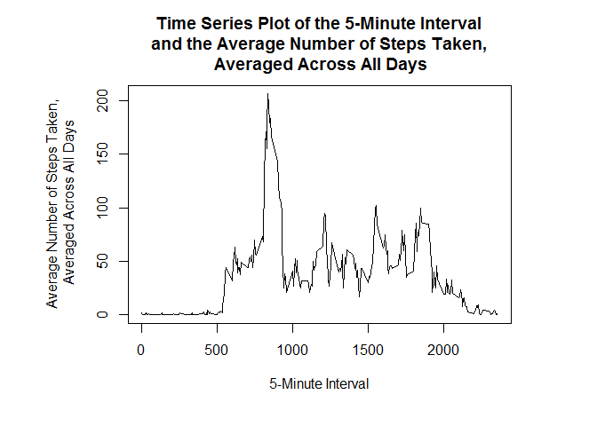
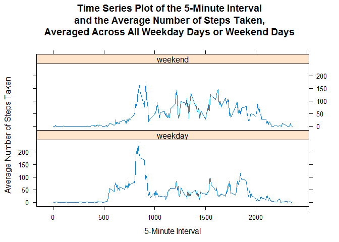

# Reproducible Research: Peer Assessment 1

## Loading and preprocessing the data

### 1. Load the data 


```r
activity <- read.csv("activity.csv")
str(activity)
```

```
## 'data.frame':	17568 obs. of  3 variables:
##  $ steps   : int  NA NA NA NA NA NA NA NA NA NA ...
##  $ date    : Factor w/ 61 levels "2012-10-01","2012-10-02",..: 1 1 1 1 1 1 1 1 1 1 ...
##  $ interval: int  0 5 10 15 20 25 30 35 40 45 ...
```

### 2. Process/transform the data


```r
activity$date <- as.Date(activity$date, format = "%Y-%m-%d")
str(activity)
```

```
## 'data.frame':	17568 obs. of  3 variables:
##  $ steps   : int  NA NA NA NA NA NA NA NA NA NA ...
##  $ date    : Date, format: "2012-10-01" "2012-10-01" ...
##  $ interval: int  0 5 10 15 20 25 30 35 40 45 ...
```

## What is mean total number of steps taken per day?

For this part of the assignment, you can ignore the missing values in the dataset.

### 1. Calculate the total number of steps taken per day


```r
steps.total <- aggregate(steps ~ date, activity, sum, na.rm=TRUE)
head(steps.total)
```

```
##         date steps
## 1 2012-10-02   126
## 2 2012-10-03 11352
## 3 2012-10-04 12116
## 4 2012-10-05 13294
## 5 2012-10-06 15420
## 6 2012-10-07 11015
```

### 2. Make a histogram of the total number of steps taken each day


```r
hist(x=steps.total$steps,
     col="blue",
     breaks=20,
     xlab="Total Number of Steps Taken Each Day",
     ylab="Frequency",
     main="Histogram of the Total Number of Steps Taken Each Day")
```

<!-- -->

### 3. Calculate and report the mean and median of the total number of steps taken per day


```r
mean(steps.total$steps)
```

```
## [1] 10766.19
```

```r
median(steps.total$steps)
```

```
## [1] 10765
```

## What is the average daily activity pattern?

### 1. Make a time series plot (i.e. type = "l") of the 5-minute interval (x-axis) and the average number of steps taken, averaged across all days (y-axis)


```r
## Average number of steps taken, averaged across all days for each 5-minute interval
avg.steps <- aggregate(steps ~ interval, activity, mean, na.rm=TRUE)

## Format plot margins
par(mai = c(1.2,1.5,1,1))

## Plot a time series plot
plot(
  x = avg.steps$interval,
  y = avg.steps$steps,
  type = "l",
  main = "Time Series Plot of the 5-Minute Interval\n and the Average Number of Steps Taken, \n Averaged Across All Days",
  xlab = "5-Minute Interval",
  ylab = "Average Number of Steps Taken,\n Averaged Across All Days"
)
```

<!-- -->

### 2. Which 5-minute interval, on average across all the days in the dataset, contains the maximum number of steps?


```r
maxsteps <- avg.steps[avg.steps$steps==max(avg.steps$steps),1]
```
The 5-minute interval that contains the maximum number of steps is 835.

## Imputing missing values
### 1. Calculate and report the total number of missing values in the dataset (i.e. the total number of rows with NAs)


```r
nrow(activity[is.na(activity$steps),])
```

```
## [1] 2304
```

### 2. Devise a strategy for filling in all of the missing values in the dataset. The strategy does not need to be sophisticated. For example, you could use the mean/median for that day, or the mean for that 5-minute interval, etc.


```r
avg.steps <- aggregate(steps ~ interval, activity, mean, na.rm=TRUE)
```
The mean for the 5-minute interval is used for filling in all of the missing values in the dataset.

### 3. Create a new dataset that is equal to the original dataset but with the missing data filled in.


```r
## Imputing missing values by using mean for that 5-minute interval.
imputeData <- activity
for (i in 1:nrow(imputeData)) {
  if (is.na(imputeData$steps[i])) {
    imputeData$steps[i] <- avg.steps[which(imputeData$interval[i] == avg.steps$interval), ]$steps
  }
}

## Proof that all missing values have been filled in.
sum(is.na(imputeData))
```

```
## [1] 0
```

### 4. Make a histogram of the total number of steps taken each day and Calculate and report the mean and median total number of steps taken per day. Do these values differ from the estimates from the first part of the assignment? What is the impact of imputing missing data on the estimates of the total daily number of steps?


```r
## Calculate the total number of steps taken per day of imputeData
totalsteps.impute <- aggregate(steps ~ date, imputeData, sum)
head(totalsteps.impute)
```

```
##         date    steps
## 1 2012-10-01 10766.19
## 2 2012-10-02   126.00
## 3 2012-10-03 11352.00
## 4 2012-10-04 12116.00
## 5 2012-10-05 13294.00
## 6 2012-10-06 15420.00
```

```r
## Make a histogram of the total number of steps taken each day
hist(x=totalsteps.impute$steps,
     col="blue",
     breaks=20,
     xlab="Total Number of Steps Taken Each Day",
     ylab="Frequency",
     main="Histogram of the Total Number of Steps Taken Each Day")
```

<!-- -->

```r
## Calculate and report the mean and median of the total number of steps taken per day
mean(totalsteps.impute$steps)
```

```
## [1] 10766.19
```

```r
median(totalsteps.impute$steps)
```

```
## [1] 10766.19
```
The means in both parts of assignment are same while the new median is slightly greater than the old median.

## Are there differences in activity patterns between weekdays and weekends?

### 1. Create a new factor variable in the dataset with two levels - "weekday" and "weekend" indicating whether a given date is a weekday or weekend day.


```r
daytype <- ifelse(weekdays(imputeData$date) %in% c("Saturday", "Sunday"), "weekend", "weekday")
imputeData$daytype <- as.factor(daytype)
str(imputeData)
```

```
## 'data.frame':	17568 obs. of  4 variables:
##  $ steps   : num  1.717 0.3396 0.1321 0.1509 0.0755 ...
##  $ date    : Date, format: "2012-10-01" "2012-10-01" ...
##  $ interval: int  0 5 10 15 20 25 30 35 40 45 ...
##  $ daytype : Factor w/ 2 levels "weekday","weekend": 1 1 1 1 1 1 1 1 1 1 ...
```

```r
head(imputeData)
```

```
##       steps       date interval daytype
## 1 1.7169811 2012-10-01        0 weekday
## 2 0.3396226 2012-10-01        5 weekday
## 3 0.1320755 2012-10-01       10 weekday
## 4 0.1509434 2012-10-01       15 weekday
## 5 0.0754717 2012-10-01       20 weekday
## 6 2.0943396 2012-10-01       25 weekday
```


### 2. Make a panel plot containing a time series plot (i.e. type = "l") of the 5-minute interval (x-axis) and the average number of steps taken, averaged across all weekday days or weekend days (y-axis).


```r
## Average number of steps taken, averaged across all weekday days or weekend days for each 5-minute interval
newavg.steps <- aggregate(steps ~ interval + daytype, imputeData, mean)

## Plot a time series plot
library(lattice)
xyplot(
  steps ~ interval | daytype,
  newavg.steps,
  type = "l",
  layout = c(1,2),
  main = "Time Series Plot of the 5-Minute Interval\nand the Average Number of Steps Taken,\nAveraged Across All Weekday Days or Weekend Days",
  xlab = "5-Minute Interval",
  ylab = "Average Number of Steps Taken"
)
```

<!-- -->

